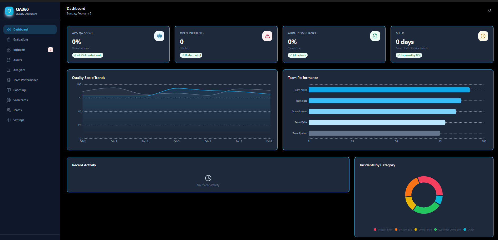
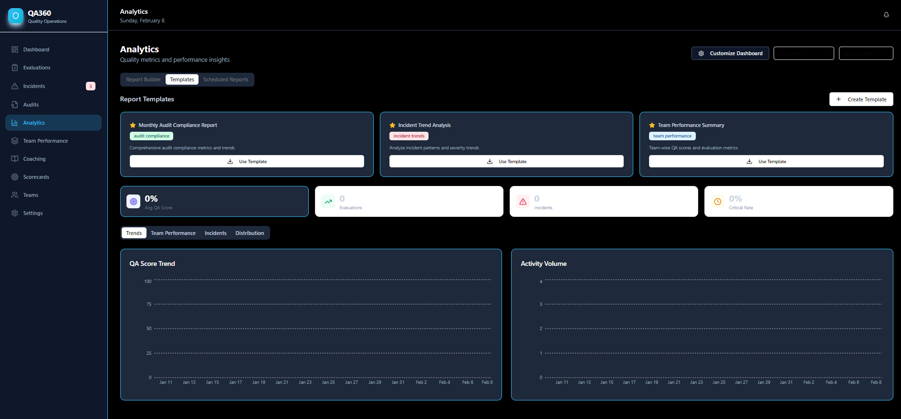
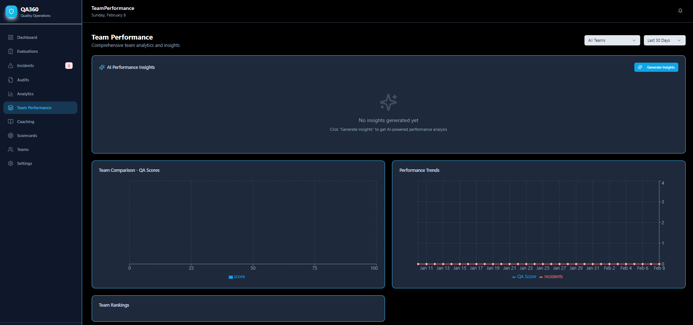

# QA360

**QA360** is an **offline-first Quality Operations (QA Ops) desktop app** for running end-to-end QA programs: evaluations, incident management, audits/compliance, coaching workflows, and performance analytics — all in one place.

It’s built as an Electron desktop application using React + Vite, with local JSON storage so it can run without a backend.

## About

QA360 is designed for teams that need a modern, fast, and organized way to manage Quality Assurance operations — especially in high-volume environments like customer support and contact centers where **coaching, audits, and KPI visibility** have to move quickly.

If you’re looking for a **QA dashboard**, **audit tracking**, **incident trend analytics**, and **team performance insights** in a single desktop experience, QA360 is built for that workflow.

## Screenshots







## Key features

- **Offline-first desktop app**: works without internet, using local storage.
- **Quality evaluations**: create and track QA scorecards, outcomes, and trends.
- **Incident management**: log incidents, triage priorities, and track resolution signals.
- **Audits & compliance**: audit workflows, assignments, and compliance progress tracking.
- **Coaching workflows**: coaching assignments and performance improvement tracking.
- **Analytics & reporting**: templates, report scheduling, exports, and dashboards.
- **Team performance**: comparison views, trends, and KPI snapshots.

## Tech stack

- **Electron** (desktop shell)
- **React 18** + **React Router**
- **Vite** (bundler/dev server)
- **Tailwind CSS** + Radix UI components
- **TanStack React Query** (data sync/cache)
- **Recharts** (charting)

## Getting started

### Prerequisites

- Node.js **18+**
- npm (or your preferred Node package manager)

### Install

```bash
npm install
```

### Run (desktop dev)

```bash
npm run electron:dev
```

### Build (desktop)

```bash
npm run electron:build
```

The packaged app output is written to `dist-electron/`.

## Project structure

- `electron/` — Electron main process / desktop glue
- `src/` — React app
- `src/api/` — local datastore API (offline storage)
- `src/pages/` — routed pages (Dashboard, Analytics, Audits, etc.)
- `src/components/` — feature and UI components

## Data storage & backups

All data is stored locally (JSON) and can be backed up by copying the directory below.

- **Windows**: `%APPDATA%/qa360-desktop/data/`
- **macOS**: `~/Library/Application Support/qa360-desktop/data/`
- **Linux**: `~/.config/qa360-desktop/data/`

## Security

Please see `SECURITY.md` for the vulnerability reporting process.

## License

This project is **proprietary**. See `LICENSE` for terms (summary: **all rights reserved** — no copying, redistribution, or rebranding).

## Topics / keywords

Quality assurance, QA ops, quality operations, QA dashboard, audit compliance, incident management, coaching workflows, performance analytics, scorecards, evaluations, contact center QA, call center quality, customer support QA, Electron, React, Vite, TailwindCSS, Recharts.